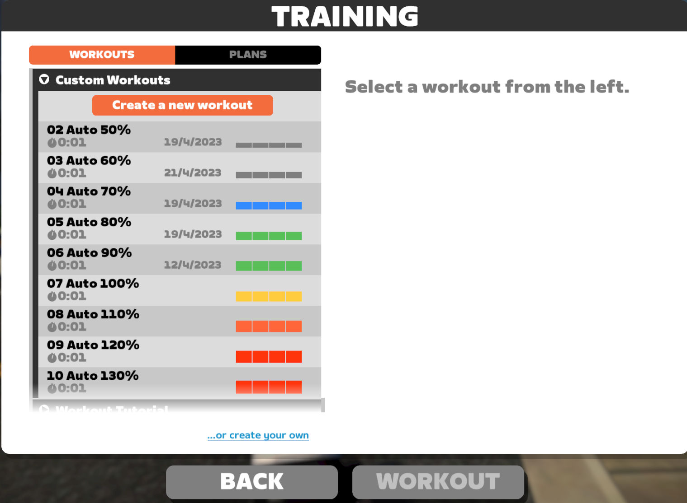

# Zwift Auto Workout

### Basic Idea

The objective is to maximize your Zwift XP reward. The basic idea is to have a short interval workout at the start of a new km, and to finish that workout before a new km. This way you'll be rewarded twice: 

1. 20 xp for each km, and 
2. 6 xp per 30 second for the interval. 

Typically you will get 32-38 xp per km with this method, depending on the speed of your free ride. The slower you ride, the more workouts can be started, and the more xp are rewarded.

This Python program helps automate starting/stopping the workout while you're riding in free ride.

### Installation

1. Currently this only works on Windows
1. Currently only tested on 1920x1080 screen resolution
1. Currently only works with metric system (i.e. distance in km, not miles)
1. Install [Sauce4Zwift](https://www.sauce.llc/products/sauce4zwift/download). Follow the installation instructions.
1. Install [AutoHotKey v2](https://www.autohotkey.com/)
1. Install Python 3
1. Clone this repository to a directory.
1. (Make sure Zwift is not running while you do this) Copy all workout files in `workouts` directory to Zwift workout folder `%USERPROFILE%\Documents\Zwift\Workouts\<zwift player id>\`

Make sure the workouts are installed properly:

1. Start zwift
1. Start free ride
1. Press E to display workout screen
1. Select **Custom Workouts** from the selection

   

1. Make sure that the *Auto XX%* workouts are displayed first in the Custom Workouts. If there are any other workouts before the *Auto XX%*, rename those workouts so that they are displayed after our workouts.
1. Make sure all *Auto XX%* workouts are displayed (i.e. from 50% to 130%)
1. Now click *02. Auto 50%* workout, and press *Workout* to start it. This is so that next time we open the workout screen, the *Custom Workouts* will be displayed.

### Running

1. Run zwift
1. Run Sauce4Zwift
1. Run *zwiftautoworkout* (`python zwiftautoworkout.py`)
1. Start a free ride in Zwift, or ride with a pace partner if you want (P.S. you cannot start a workout while riding on an event)
1. At the start of new km, *zwiftautoworkout* will automatically pick the best *Auto* workout based on your average watt in the past few seconds, and start it.

   1. You can set the workout in ERG or non-ERG mode, it's up to you.
   1. Note that if you activate ERG mode, you may need to make adjustment to the workout watt to match your desired watt.
   1. Once the workout ends, *zwiftautoworkout* will automatically close the End workout dialog.
   1. *zwiftautoworkout* now calculates the average speed of the past few seconds, and determine if new workout can be started without crossing the new km boundary.
    
       - If so, it will start new workout, repeating these steps.
       - If not, it will sit idle, waiting till the next km, while still calculating the current average speed to determine if it can start new workout.

